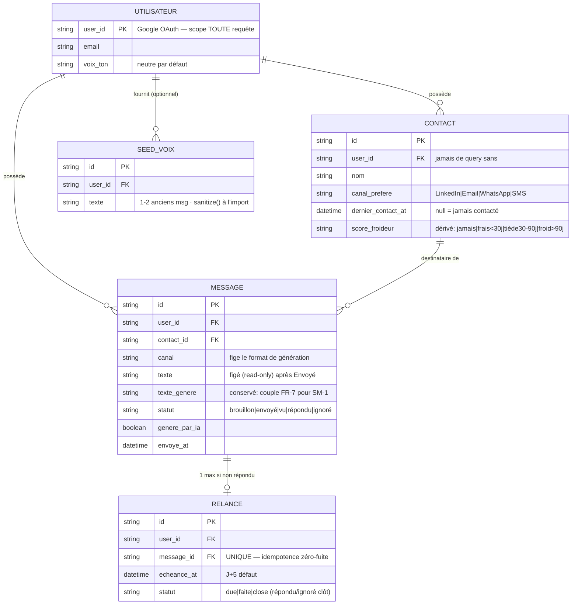
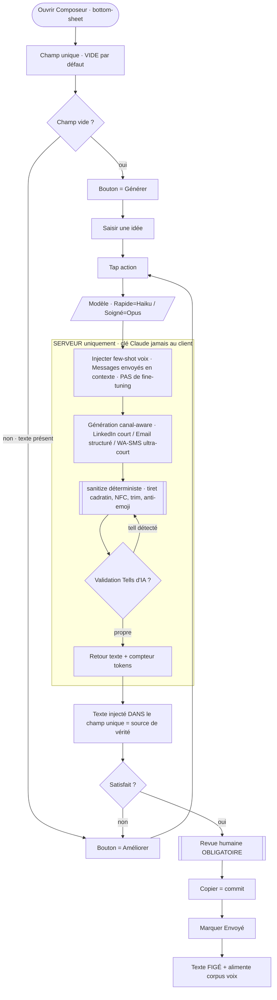
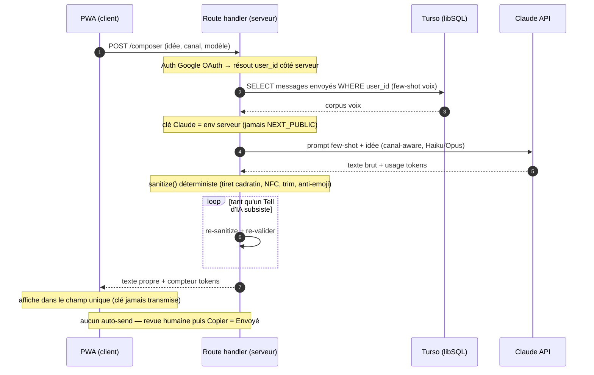
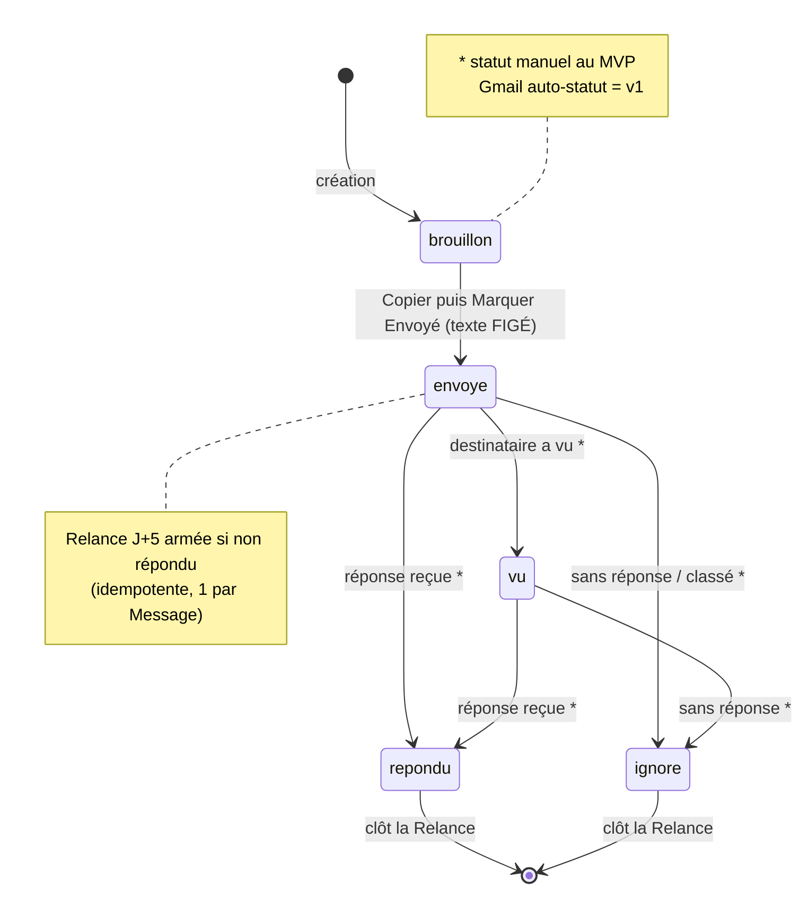
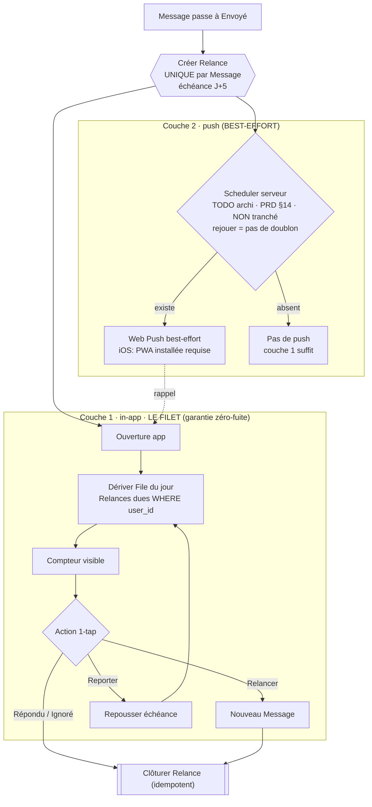
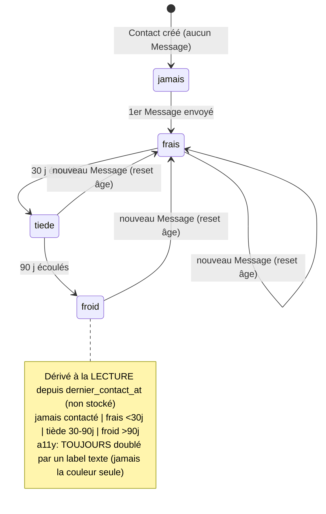

# Diagrammes — Plume (repo job-pipeline)

_Source : `project-context.md` + PRD/UX finaux (`docs/planning-artifacts/`).
À réutiliser par l'architecture (`bmad-create-architecture`) et les epics/stories.
En cas de conflit PRD↔UX, l'UX prime. Dernière mise à jour : 2026-06-16._

---

## #5 — Modèle de domaine MVP (ER)

> Le *corpus few-shot voix* n'est PAS une table : c'est l'ensemble des `MESSAGE` au
> statut `envoyé` (apprentissage continu, pas de fine-tuning). `SEED_VOIX` = seulement
> l'amorce optionnelle d'onboarding. Toute lecture/écriture est scopée par `user_id`.

---

## #2 — Flow Composeur (le moat)

Points clés : champ vide par défaut · bouton intelligent Générer/Améliorer ·
`sanitize()` post-traitement déterministe **côté serveur** + re-validation en boucle ·
clé Claude jamais au client · aucun auto-send (Copier → Envoyé manuel).

---

## #3 — Appel Claude serveur-only (séquence)

Frontière de sécurité que l'architecture doit garantir : la clé Claude vit en variable
d'env **serveur** (jamais `NEXT_PUBLIC_*`), aucun appel direct browser → Anthropic.
`sanitize()` + validation des Tells d'IA bouclent côté serveur avant renvoi. Aucun
auto-send : revue humaine puis Copier = Envoyé.

---

## #1 — Cycle de vie du `Statut` du Message (state)

Le texte est **figé (read-only)** au passage `brouillon → envoyé`. Au MVP toutes les
transitions sont **manuelles** (le statut auto via Gmail est différé en v1). La `Relance`
zéro-fuite est armée à J+5 sur tout `Message` envoyé non répondu ; `répondu`/`ignoré` la
clôt de façon idempotente.

---

## #4 — `Relance` zéro-fuite, 2 couches (flowchart)

**Couche 1 in-app = le filet** (suffit à la garantie zéro-fuite) : `File du jour` dérivée
à la lecture des échéances + compteur visible, action 1-tap. **Couche 2 push = best-effort**
et dépend d'un **scheduler serveur NON tranché (PRD §14)** → tant qu'il n'existe pas,
n'implémenter QUE la couche 1 ; le déclencheur push = TODO archi. `Relance` **idempotente** :
1 par `Message` non répondu (unicité), rejouer le scheduler ne crée ni doublon ni double
notif ; `répondu`/`ignoré` clôt de façon idempotente.

---

## #6 — `Score de froideur` (state, dérivé)

Le score est **dérivé à la lecture** depuis `dernier_contact_at` (jamais stocké) : un
`Contact` sans `Message` est *jamais contacté* ; le 1er envoi le rend *frais* ; il vieillit
en *tiède* (30 j) puis *froid* (90 j) ; tout nouveau `Message` envoyé **réinitialise** l'âge.
**a11y :** la couleur n'est jamais le seul signal — toujours doublée par un libellé texte
(coldtag), et jamais alarmiste.

