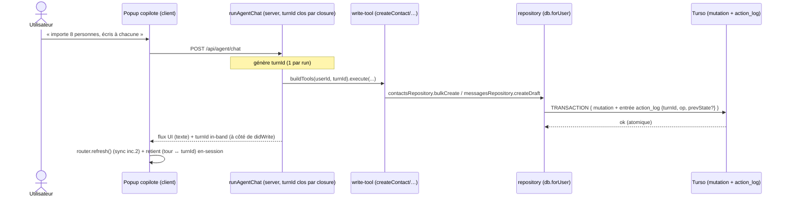
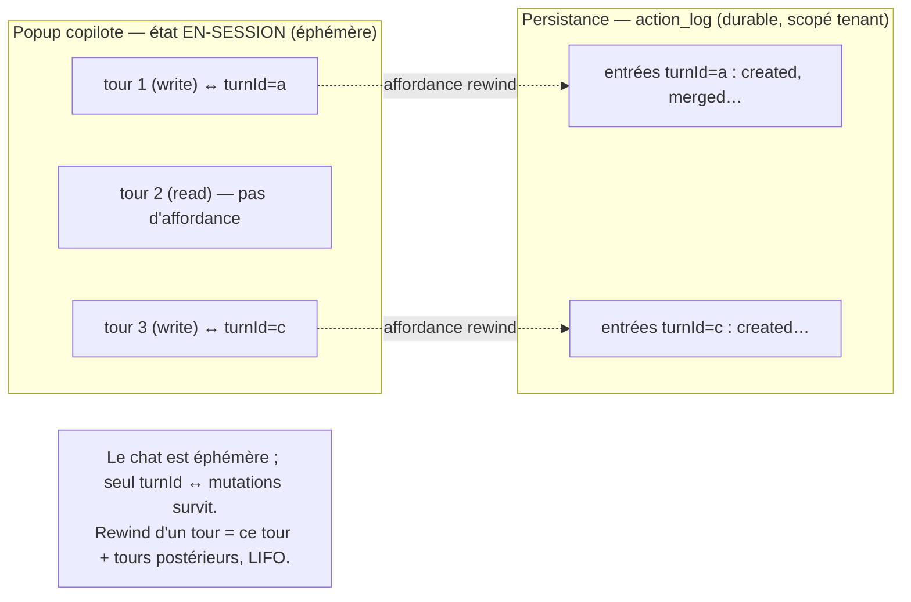

# Diagrammes — journal d'actions & rewind

Companion de [`SPEC.md`](SPEC.md). Les diagrammes vivent ici (kernel = prose seule).

## Flux : un tour écrit → journal atomique



## Flux : rewind d'un tour (affordance humaine)

```mermaid
sequenceDiagram
    actor U as Utilisateur
    participant UI as Popup copilote (client)
    participant SA as Server action rewind (auth + vérif tenant)
    participant AL as actionLogRepository (db.forUser)
    participant Repo as repositories (contacts/messages)
    participant DB as Turso

    U->>UI: clic « Annuler ce tour » (mauve = action)
    UI->>SA: rewind(turnId)  %% turnId retenu en-session
    Note over SA: auth()→401 ; vérifie que turnId ∈ tenant courant
    SA->>AL: lit entrées du tour + tours postérieurs (ordre LIFO)
    loop par entrée, ordre chronologique inverse
        AL-->>SA: {op, entityId, prevState?}
        alt op = created
            SA->>Repo: archivedAt = now (re-archivage)
        else op = merged / reactivated
            SA->>Repo: restaurer prevState
        else entityType = message (brouillon)
            SA->>Repo: retrait soft (jamais DELETE)
        end
        Repo->>DB: update soft
    end
    SA->>AL: insère entrée op = "rewind" {turnId annulés} (audit)
    SA-->>UI: ok → revalidate / router.refresh() (sync inc.2)
    UI->>UI: galerie reflète l'annulation, sans reload
```

## État du « point de rewind » (en-session, sans historique persistant)


